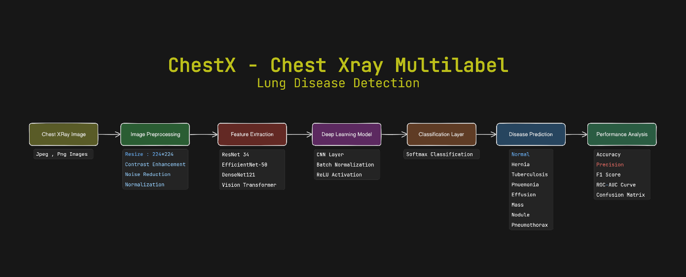
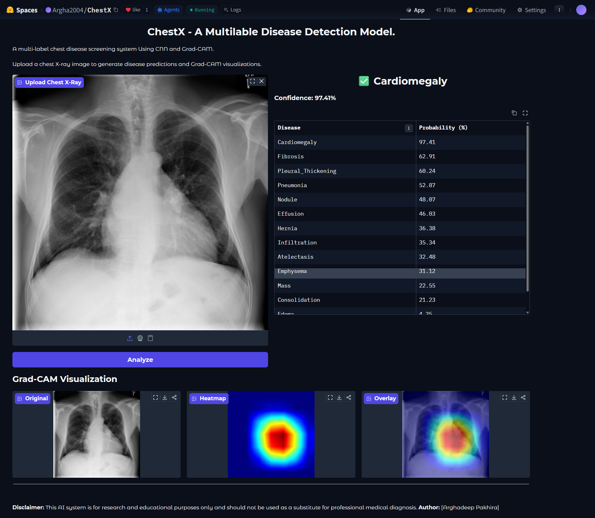

# ChestX: AI-Powered Chest X-Ray Disease Detection System

<p align="center">
  
</p>

<p align="center">
  
</p>


## Overview

ChestX is an end-to-end Artificial Intelligence system designed for automated chest X-ray disease detection. The project combines Deep Learning, Medical Image Analysis, Backend API Services, and a Modern Android Mobile Application to provide fast and accessible chest radiograph screening.

The system uses a CNN-based deep learning model trained on large-scale chest X-ray datasets to identify multiple thoracic diseases from chest radiographs. Predictions are served through a backend API and visualized through a user-friendly Android application.

---

## Key Features

### AI Disease Detection

* Multi-label chest disease classification
* DenseNet121-based deep learning architecture
* Transfer learning approach
* Weighted Binary Cross Entropy Loss
* ROC-AUC based evaluation
* Probability-based disease prediction

### Explainable AI

* Grad-CAM heatmap generation
* Visual localization of disease-related regions
* Model interpretability support
* Clinical decision Report support 

### Android Application

* Modern Android UI using Jetpack Compose
* Upload X-ray images from gallery
* Camera image capture support
* on Device Model Running
* Real-time disease prediction
* Confidence score visualization
* Prediction history
* Grad-CAM visualization
* Can Load Your Own Tarined Model
* Mobile-first design

### Research-Oriented Development

* Medical AI workflow implementation
* Reproducible training pipeline
* Dataset preprocessing utilities
* Evaluation and benchmarking tools

---

## Repository Structure

```text
ChestX/
│
├── Frontend/
│   ├── Android Application
│   ├── Jetpack Compose UI
│   ├── API Integration
│   ├── Camera & Gallery Support
│   └── Visualization Components
├── Model Train/
│   ├── Check_Cuda.py             # Check If Your System Have Cuda or Not
│   ├── download_dataset.py       # Download NIH Chest-Xray Dataset
│   ├── dataset.py                # This Dataset Script only for train_script_1
│   ├── export_onnx.py            # Export Your Pytorch model into onnx Configuration
│   ├── train_script_1.py         # First Configuration Training Script
│   ├── train_script_2.py         # Second Configuration Training Script             
│   ├── ex_train_script.py        # Experiment Configuration Training Script
│   ├── evaluate_models.py        # Evaluate Your Each Model's Accuracy
│   ├── chestx.ipynb              # Run All Scripts in Kaggle/Google Colab
│   ├── test.py                   # Test your Best Model              
│   ├── requirements.txt
│   └── Readme.md
│        
├── License
├── .gitignore
├──  public/
└── README.md
```

---

## Project Architecture

```text
Chest X-Ray Image
        │
        ▼
 Android Application
        │
        ▼
    Backend API
        │
        ▼
  Image Preprocessing
        │
        ▼
 DenseNet121/EfficientNet-B0/EfficientNetV2-S AI Model
        │
        ▼
 Disease Prediction
        │
        ├── Confidence Scores
        ├── Disease Labels
        └── Grad-CAM Heatmap
        │
        ▼
 Android Results Dashboard
```

---

## Supported Disease Categories

The model is designed for multi-label classification of chest X-ray diseases including:

* Atelectasis
* Cardiomegaly
* Consolidation
* Edema
* Effusion
* Emphysema
* Fibrosis
* Hernia
* Infiltration
* Mass
* Nodule
* Pleural Thickening
* Pneumonia
* Pneumothorax

---

## Deep Learning Model

### Model Architecture

* DenseNet121/EfficientNetV2-S/ResNet34/DenseNet201
* Transfer Learning
* Multi-label Classification
* Sigmoid Activation
* Weighted Binary Cross Entropy Loss

### Training Strategy

* Image Resizing
* Data Augmentation
* Class Imbalance Handling
* Weighted BCE Loss
* Learning Rate Scheduling
* Best Model Checkpoint Saving

### Evaluation Metrics

* ROC Curve
* Area Under Curve (AUC)
* Validation Loss
* Precision
* Recall
* F1 Score

---

## Datasets

The project is designed to support large-scale public chest X-ray datasets such as:

### NIH ChestX-ray14

* Over 100,000 chest X-ray images
* 14 disease labels
* Widely used benchmark dataset

### CheXpert

* Large-scale chest radiograph dataset
* Expert-labeled findings
* Clinical-grade annotations

### MIMIC-CXR

* Hospital-scale chest radiograph dataset
* Rich clinical metadata
* Research-oriented benchmark

---

## Android Application

### Features

* Modern Material Design UI
* Dark Theme Support
* Image Upload
* Camera Capture
* Prediction Dashboard
* Offile On Device Mobile Inference
* Disease Confidence Scores
* Grad-CAM Visualization
* Analysis History
* Mobile Optimized Interface

### Technology Stack

* Kotlin
* Jetpack Compose
* Material 3
* Retrofit
* Coil
* CameraX
* Navigation Compose
* ViewModel Architecture

---

## Backend

### Technology Stack

* Python
* FastAPI
* PyTorch
* OpenCV
* NumPy
* Pillow
* Uvicorn

---

## Model Training

### Technology Stack

* Python
* PyTorch
* Torchvision
* NumPy
* Pandas
* Scikit-learn
* Matplotlib

### Training Pipeline

1. Dataset Loading
2. Data Cleaning
3. Label Processing
4. Data Augmentation
5. Model Training
6. Validation
7. AUC Evaluation
8. Checkpoint Saving

---

## Installation

### Clone Repository

```bash
git clone https://github.com/Argha2004/ChestX.git
cd ChestX
```

---

## Run Backend

```bash
cd Backend

pip install -r requirements.txt

uvicorn app:app --reload
```

---

## Run Android Application

Open the Frontend project in Android Studio and run:

```bash
Build → Run App
```

---

## Train Model

```bash
cd "Model Train"

python train.py
```

---

## Future Improvements

* TensorFlow Lite Deployment
* Multi-language Support
* Doctor Dashboard
* Cloud Deployment
* Patient Management System
* Real-Time Clinical Integration

---

## Research Applications

This project can be used for:

* Medical AI Research
* Computer Vision Research
* Healthcare Informatics
* Deep Learning Studies
* Academic Projects
* Final Year Projects
* Medical Imaging Applications

---

## Disclaimer

This project is intended for educational, research, and development purposes only. The predictions generated by the model should not be used as a substitute for professional medical diagnosis or clinical decision-making.

---

## Author

**Arghadeep Pakhira**     Student | Sister Nivedita University

**Dr. Bidyut Saha**      Assistant Professor | Sister Nivedita University

Developed as part of an AI-powered Medical Imaging and Chest X-Ray Disease Detection research project.
If you find this project useful, consider giving it a star.

